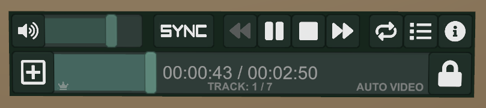

# VideoTXL
Prefabs for video players and A/V support.  Sync and local-only flavors of the video player are available, with multiple shared plugin components.

Support discord: https://discord.gg/cWKeenfsuq

## Sync Video Player
The general purpose video player for worlds.  Supports the following features:

* Optional support for all shared components listed below
* AVPro and Unity Video backend supported.  Auto-selected by default but can be manually set.
* Streams or videos
* Video seeking and current position / duration
* Video looping
* Local resync
* Track queueing (by opening the load URL field, pasting a URL, then closing the field without committing)
* Locking and access control with whitelist support
* Static playlists (will eventually be runtime editable)
* Event system for custom plugins

## Local Video Player Features
Local video players can be useful for playing a burned in stream during a live event, or for populating screens in multiple booths in a showcase hall.

* Optional support for all shared components listed below
* Setup with either AVPro or Unity video player source
* Streams or videos
* Loop and resume last position options
* Supports zone triggers to start or stop playback
* Supports burned-in URLs at multiple quality levels that can be user-selected at runtime
* Event system for custom plugins

## Shared Components
### Screen Manager
  * Can show alternate screens for stopped, loading, error, and audio-only states
  * Can update materials on multiple screen objects
  * Can update textures on multiple materials
  * Auto-detect audio-only sources
  * Unifies video data from AVPro or Unity Video sources
### Audio Manager
  * Manage volume on one or more audio sources
  * Supports artificially scaling volume between two collision boundaries
### RT Blank
  * Blanks a render texture (such as the unity video RT) when video player goes into a stopped state
### Local Controls
  * A separate UI providing local-only AV options that can be duplicated in the world any number of times
  * Quickly setup for any of these options:
    * Volume slider
    * Resync button
    * stream quality selection (local player only)
  * All instances can be tied to a color profile for fast customization

## Installation
1. Install the latest VRCSDK and latest release of UdonSharp
2. Install the latest release or check out latest source
3. Select the most appropriate prefab from the prefabs folder and drag into scene.
4. Resize screen, move components like control panels around, and further customize components as necessary.

An example world is included with multiple local video player setups and a sync player setup to demonsrate the various ways players can be configured.
